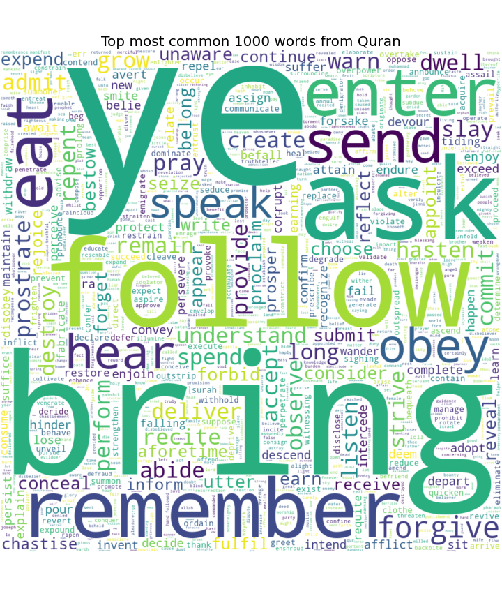
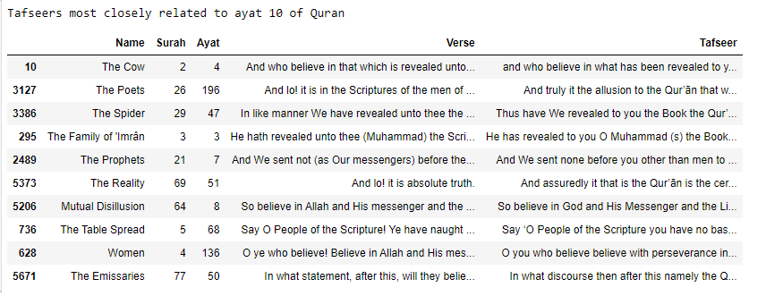
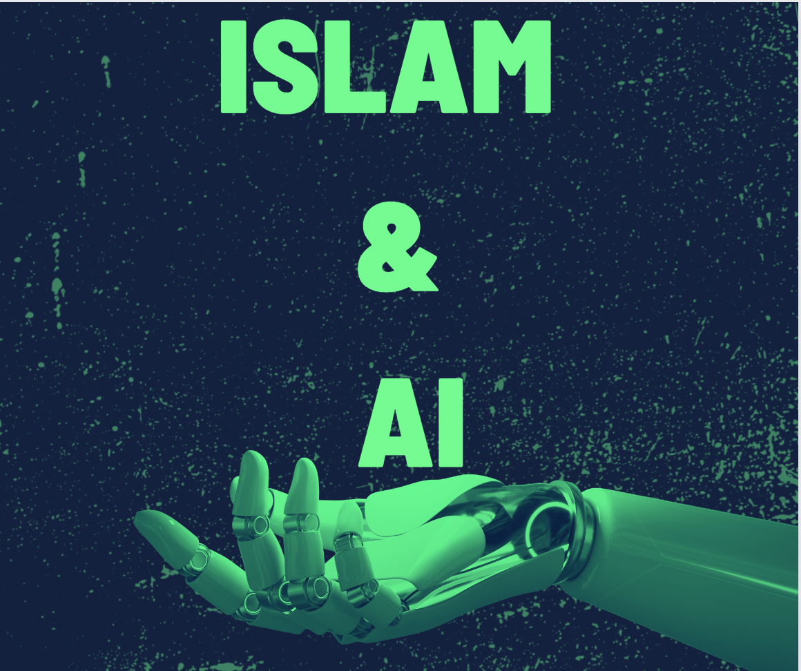

# QURAN NLP

NLP & AI on the Quran!

# Dataset Structure

### The Biggest Collection Available Online!

- **data**
  - **hadith** (89,144 hadiths!)
    - **arabichadith** (62,169 hadith)
    - **thaqalayn** (26,975 hadith)
    - **kaggle_hadith_clean.csv** (34,410 hadith)
    - **kaggle_rawis.csv** (24,028 rawis)
  - **namesofallah** (99)
  - **surah** (114)
  - **tafseer** (4 * 6,236)
  - **translation** (9 * 6,236)
  - **main_df.csv** (6,236)

## Motivation

I thought about using my knowledge of ML & NLP in the Quran to make something out of it. I have tried to
get a summary of the Verses and Tafasir, getting the sentiment analysis, I have made a Search Engine so that 
any query can be searched as easily as a person does on Google

This is an open source project and I am trying to host it somewhere so people can use it and make the most out of it.

Collaborations are HIGHLY welcome! If anyone can help with the code or help fact-check the search results or summaries 
that would be a HUGE help!

Looking forward to doing something great with the Quran & NLP

## Work till now

1. Notebook to scrape data from the website: https://www.altafsir.com/
2. Provided English translation and Tafseer of Quran in easy-to-use CSV format
3. Used NLP to get the top 1000 words used in the Quran
4. Used sentiment analysis for the Quran each surah
5. Text Summarization for the Quran & each Surah
6. Search Engine for Quran using Google USE (Universal Sentence Encoder)
7. Similarity Index of Translation & Tafseer
8. Notebook to scrape data from https://thaqalayn.net/ which is a Comprehensive Shia Hadith Library 
   

## Future Goals

1. Add more Data!
2. Add more Tafaseer and translation to better train the NLP model for Search Engine & Analysis
3. Make an end-to-end application so that everyone can benefit from the newly trained models
4. Find insightful things from the Quran
5. Make an Arabic NLP model capable of understanding the Quran
6. Make a single graph database encompassing Islamic knowledge
7. Making an AI tool to authenticate Hadith

## Important Note

If you find any type of error or mistake in the translation please correct me. If you find the work interesting feel free to build more on it!

## How To Contribute

The CSV data at "./data/main_df.csv" is the latest version of the data being used for NLP. I have tried to add as many 
translations and Tafaseer I can, Anyone can add more columns to the Translations or Tafaseer, If anyone wants to use the 
df for their projects please do

Dataset also available at https://www.kaggle.com/datasets/alizahidraja/quran-nlp 
You can use Kaggle to work on it online too!

