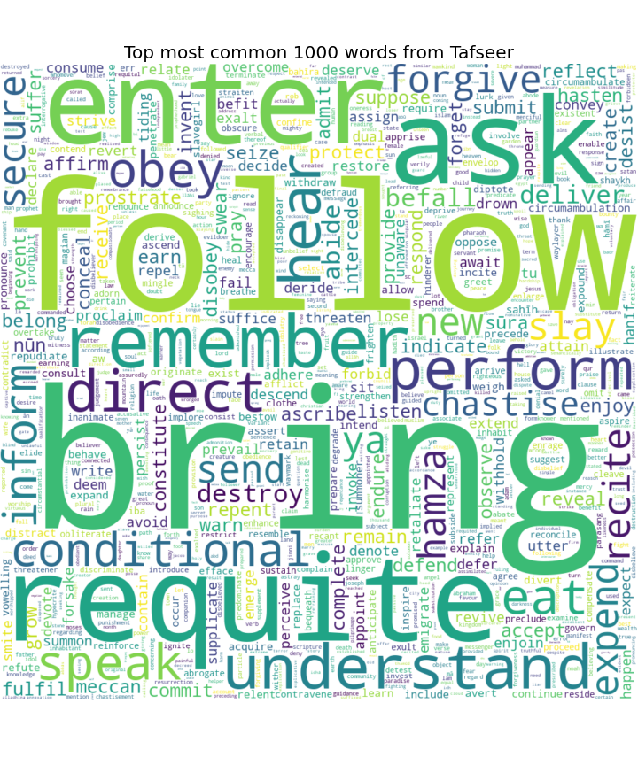

# QURAN NLP

Using NLP knowledge on the Quran and looking forward to making something amazing out of it!

## Work till now

1. Provided English translation of Quran in easy to use CSV format
2. Used NLP to get top 100 words used in Quran
3. Used sentiment analysis for each surah
4. Text Summarization for Quran & each Surah
5. Search Engine for Quran using Google USE (Universal Sentence Encoder)

### Important Note

If you find any type of error or mistake in the translation please correct me. If you find the work interesting feel free to build more on it!
