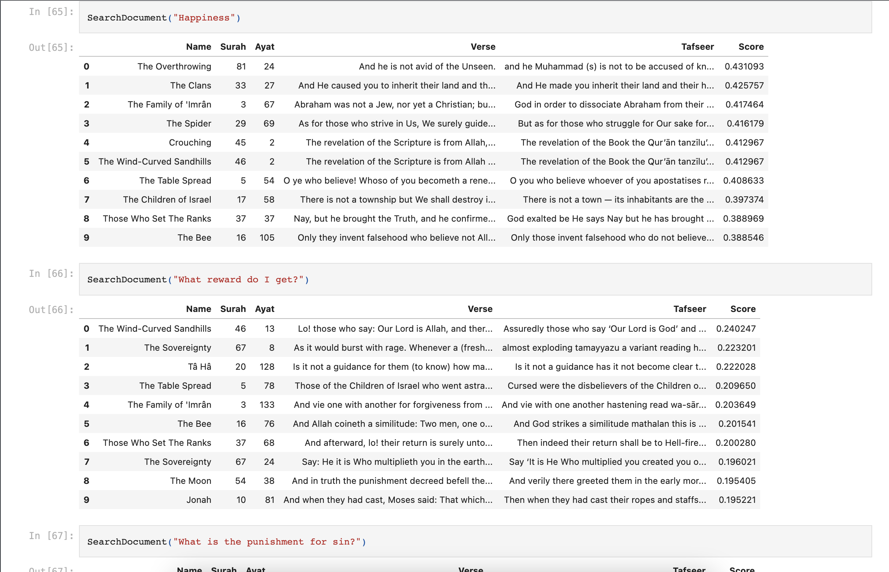

# QURAN NLP

NLP & ML on the Quran!

## Motivation

I thought about using my knowledge of ML & NLP on the Quran to make something out of it. I have tried to
get summary of the Verses and Tafasir, getting the sentiment analysis, I have made a Search Engine so that 
any query can be searched as easily as a person does on Google

This is a open source project and I am trying to host it somewhere so people can use it and make the most out of it.

Collaborations are HIGHLY welcome! If anyone can help with the code or help fact check the search results or summaries 
that would be a HUGE help!

Looking forward to do something great with Quran & NLP

## Work till now

1. Notebook to scrape data from an authentic website: https://www.altafsir.com/
2. Provided English translation and Tafseer of Quran in easy to use CSV format
3. Used NLP to get top 1000 words used in Quran
4. Used sentiment analysis for Quran each surah
5. Text Summarization for Quran & each Surah
6. Search Engine for Quran using Google USE (Universal Sentence Encoder)
7. Similarity Index of Translation & Tafseer
   

## Future Goals

1. Add more Tafaseer and translation to better train the NLP model for Search Engine & Analysis
2. Make a end-to-end application so that everyone can benefit from the newly trained models
3. Find insightful things from the Quran

### Important Note

If you find any type of error or mistake in the translation please correct me. If you find the work interesting feel free to build more on it!
