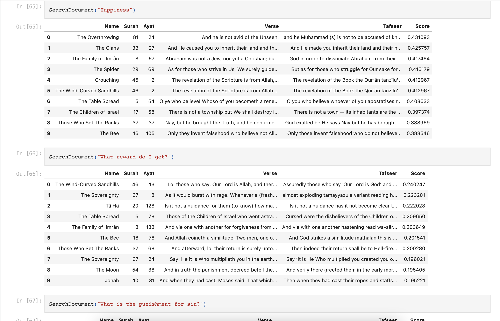
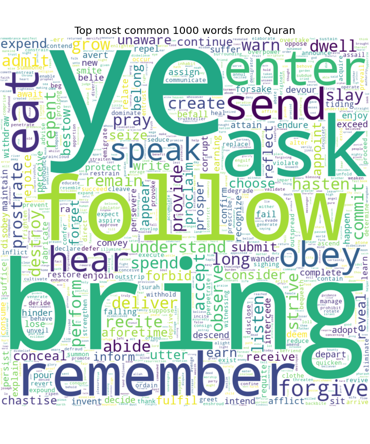
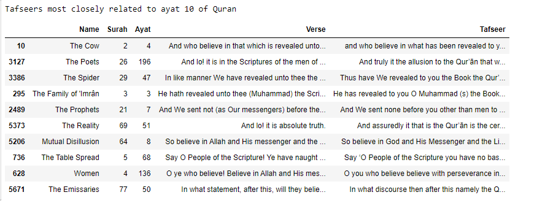
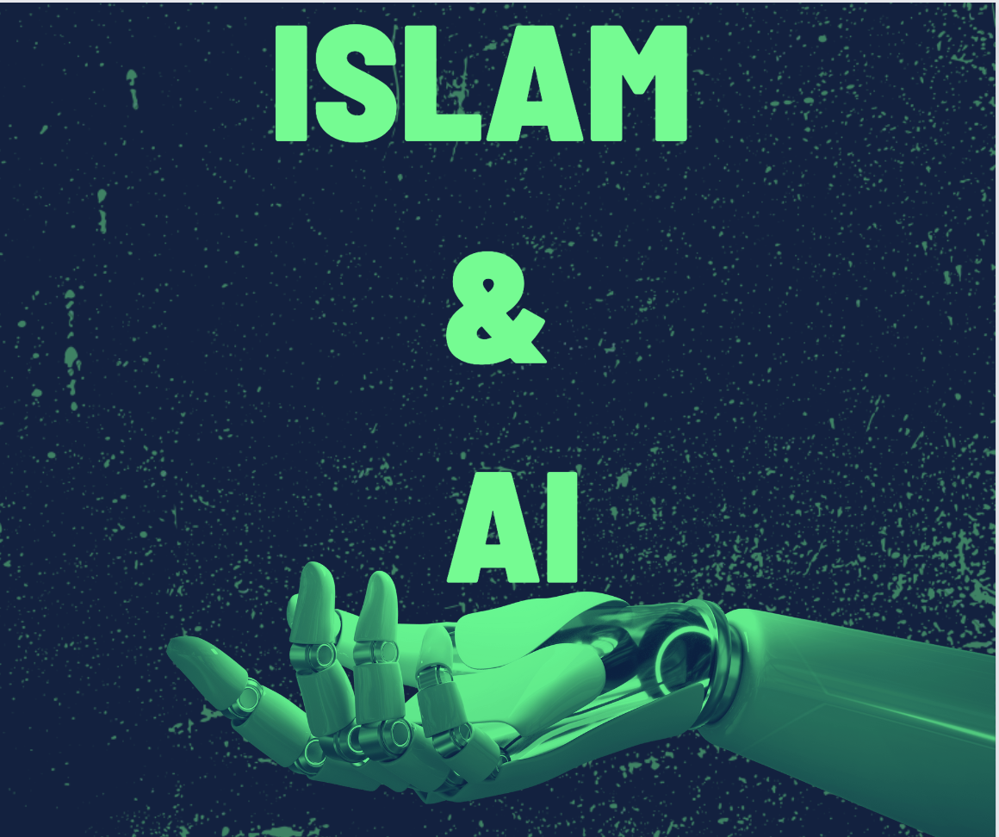

# QURAN NLP

NLP & AI on the Quran!


# Dataset Structure

> **Canonical layer** — `data/canonical/` holds a cleaned, long-format version of the
> Quran-side data (one row per `ayah_no_quran`), produced by
> `python3 scripts/normalize_data.py` and checked by `python3 scripts/validate_data.py`.
> See [`data/canonical/README.md`](data/canonical/README.md) for the schema and per-source
> alignment status.

- **data**
  - **quran**
    - **corpus** (190,655)
      - **dictionary** (53,924)
      - **morphology** (128,219)
      - **verbs** (1,475)
      - **lemmas** (3,680)
      - **lemmas (grouped)** (3,357)
    - **quran.csv** (6,236)
  - **hadith** (700,000+ hadiths!)
    - **Sanadset** (650,000 hadith) (Note that this data crosses the limit set by github, you can download it from Kaggle)
    - **arabichadith** (62,169 hadith)
    - **thaqalayn** (26,975 hadith)
    - **kaggle_hadith_clean.csv** (34,410 hadith)
    - **kaggle_rawis.csv** (24,028 rawis)
  - **namesofallah** (99)
  - **surah** (114)
  - **tafseer** (4 * 6,236)
  - **translation** (9 * 6,236)
  - **main_df.csv** (6,236)


## Python package & CLI

Zero-dependency package for loading and searching the canonical dataset:

```bash
pip install -e .            # installs the `quran-nlp` package + CLI
quran-nlp search "mercy" --k 5     # English BM25 search
quran-nlp search "الرحمن الرحيم" --arabic
quran-nlp ayah 2:255         # show an ayah with all translations + tafaseer
```

**Semantic search** (optional `[semantic]` extra — sentence-transformers):

```bash
pip install -e ".[semantic]"
python scripts/build_embeddings.py        # precompute embeddings (offline)
quran-nlp search "forgiveness" --semantic
quran-nlp search "الصبر" --semantic       # Arabic auto-detected
```

Embeddings use `intfloat/multilingual-e5-small` by default (good Arabic+English;
configurable via `--model`). Note: off-the-shelf multilingual models are weaker on
classical Quranic Arabic than on English — for exact Arabic word lookups prefer
`--arabic` (diacritic-insensitive lexical search).

Or in Python:

```python
from quran_nlp import load_quran, EnglishSearch, search_arabic
EnglishSearch().search("patience", k=5)
search_arabic("الرحمن الرحيم", k=5)

from quran_nlp.embeddings import SemanticSearch  # requires [semantic]
SemanticSearch().search("forgiveness", k=5)
```

Also in `scripts/`:
- `normalize_data.py` — rebuild `data/canonical/` from the raw sources
- `validate_data.py` — invariant checks (run in CI)
- `build_embeddings.py` — precompute semantic-search embeddings

## Motivation

I thought about using my knowledge of ML & NLP in the Quran to make something out of it. I have tried to
get a summary of the Verses and Tafasir, getting the sentiment analysis, I have made a Search Engine so that 
any query can be searched as easily as a person does on Google

This is an open source project and I am trying to host it somewhere so people can use it and make the most out of it.

Collaborations are HIGHLY welcome! If anyone can help with the code or help fact-check the search results or summaries 
that would be a HUGE help!

Looking forward to doing something great with the Quran & NLP



## Work till now

1. Notebook to scrape data from the website: https://www.altafsir.com/
2. Provided English translation and Tafseer of Quran in easy-to-use CSV format
3. Used NLP to get the top 1000 words used in the Quran
4. Used sentiment analysis for the Quran each surah
5. Text Summarization for the Quran & each Surah
6. Search Engine for Quran using Google USE (Universal Sentence Encoder)
7. Similarity Index of Translation & Tafseer
8. Notebook to scrape data from https://thaqalayn.net/ which is a Comprehensive Shia Hadith Library 
9. Notebook to scrape https://corpus.quran.com/ which contains corpus of Quran, including dictionary, verbs, lemmas, morphology
   






## Future Goals

1. Add more Data!
2. Add more Tafaseer and translation to better train the NLP model for Search Engine & Analysis
3. Make an end-to-end application so that everyone can benefit from the newly trained models
4. Find insightful things from the Quran
5. Make an Arabic NLP model capable of understanding the Quran
6. Make a single graph database encompassing Islamic knowledge
7. Making an AI tool to authenticate Hadith


## Important Note

If you find any type of error or mistake in the translation please correct me. If you find the work interesting feel free to build more on it!


## How To Contribute

Feel free to make notebooks on the current data, add more data (authentic and with sources) and have a look at the current data to make sure it is authentic and up-to-date!

Dataset also available at https://www.kaggle.com/datasets/alizahidraja/quran-nlp 
You can use Kaggle to work on it online too!

Project started: March 1, 2023


